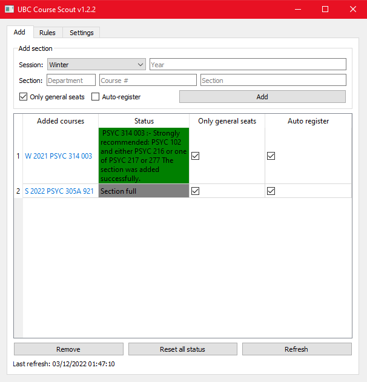
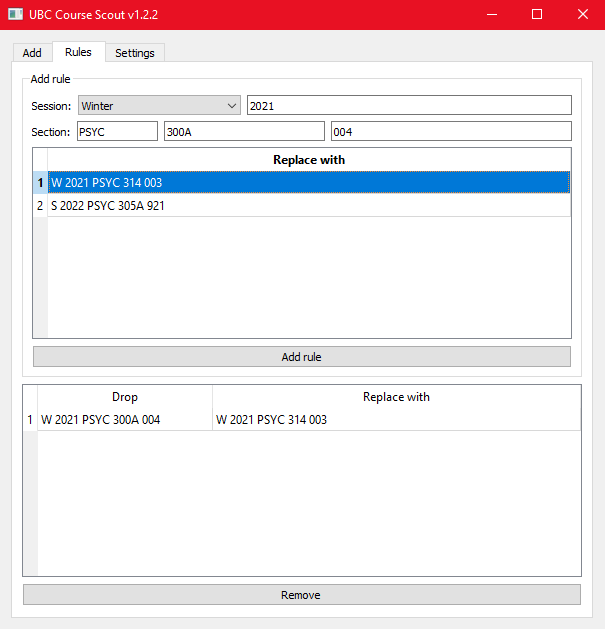

# UBC-Course-Scout
A Python 3.8 program with a graphical user interface to aid with UBC course registration.

## About
UBC Course Scout is a course registration tool that can automatically register for desired sections when a seat is available.
It uses web-scraping to find the number of seats for a given course section, and it can register in the section
once a seat is available depending on the user's preferences.

The program takes advantage of an automated browser to facilitate automatic registration.
## Adding a course to watch-list
To add a section to the watch-list, the following info is required and can be entered into their respective boxes:
- Session _(e.g. Winter)_
- Year _(e.g. 2021)_
- Department _(e.g. CPSC)_
- Course # _(e.g. 320)_
- Section _(e.g. 101)_

The user can also specify whether to only consider general seats, and
if the program should automatically register in the section once it is available.
## Switching courses

To facilitate automatically dropping one section for another, the user can optionally add a "rule".

This is intended for situations such as when a user is unable to register in a section because it would exceed the
maximum amount of credits for the term.
  
To get started, the preferred section must first be already added to the watch-list and then selected in the "Replace with" table.
The user will then need to specify a section that they are currently registered in before pressing the add button. Added rules will be displayed
in the bottom table and can be removed anytime.

Once a watch-listed section with auto-register is available, the program will
proceed to drop the sections(s) specified in the rule immediately before registering.

**Important things to consider:**

- It is your responsibility to confirm beforehand that you are able to register in the section in normal circumstances (such as having enough
  remaining credits _after_ dropping or satisfying all the pre-requisites for the course). **You don't want to find out when the registration fails
  after dropping your section(s).**
- Just like doing it manually, there is a small window between dropping a course and registering in another where someone can _snipe_ the available seat.
  **Though the window is much slimmer when the process is automated, it is still possible for someone to take your place in between the two steps, resulting in a failed registration after
  dropping your section(s).**

**Use this feature at your own risk.**

## Notes
- In order for the auto-registration feature to take effect, the user must enter and test their CWL login in the settings
  tab.
- Sections and rules added to the program will be saved as separate files in the same directory of the app.
    - For security reasons, the user's CWL login will NOT be saved to disk and will need to be entered again between
  sessions.
- If the refresh timer is active and there are no more valid sections to monitor (e.g. all the sections are invalid or have been successfully registered in), the refresh timer will stop automatically.
    - It recommended that the refresh interval be at least 30 seconds to avoid HTTP flood.
- Refreshing an excessive amount of courses at a time will likely cause the server to flag
  the automated browser as suspicious (and thus return a false "Invalid section" error).
    - If this is the case, try disabling "Asynchronous refresh" in the settings tab.
## Libraries used
- [PyQt5](https://pypi.org/project/PyQt5/) for GUI
- [BeautifulSoup4](https://pypi.org/project/beautifulsoup4/) for web-scraping
- [Selenium](https://pypi.org/project/selenium/) for browser automation
## Changelog

v1.2.7:
- Improved logging.

v1.2.6:
- Fixed async and page checks that weren't working as intended.

v1.2.5:
- Added check for when course pages go down during nightly SSC maintenance.

v1.2.4:
- Change to ChromeDriver version 98.0.4758.102 with included binary.
  https://sourceforge.net/projects/portableapps/files/Source/Google%20Chrome/Launcher/

v1.2.3:
- Set EdgeChromiumDriver to 98.0.1108.92.

v1.2.2:
- Removed int validator for course number to allow values such as 300A.

v1.2.1:
- Rules tab will now update accordingly when the user removes a watch-listed section.

v1.2:
- Added a "rules" tab to facilitate switching sections.
    - The user can specify to drop one of their registered sections before the tool registers in a section on the watch-list.
- Cleaned up requirements.txt.
- Added asynchrony to section refreshes.
    - Can be toggled off in the settings tab to avoid request spam.

v1.1:
- Timer will now automatically stop if there are no more valid sections to refresh.
  

